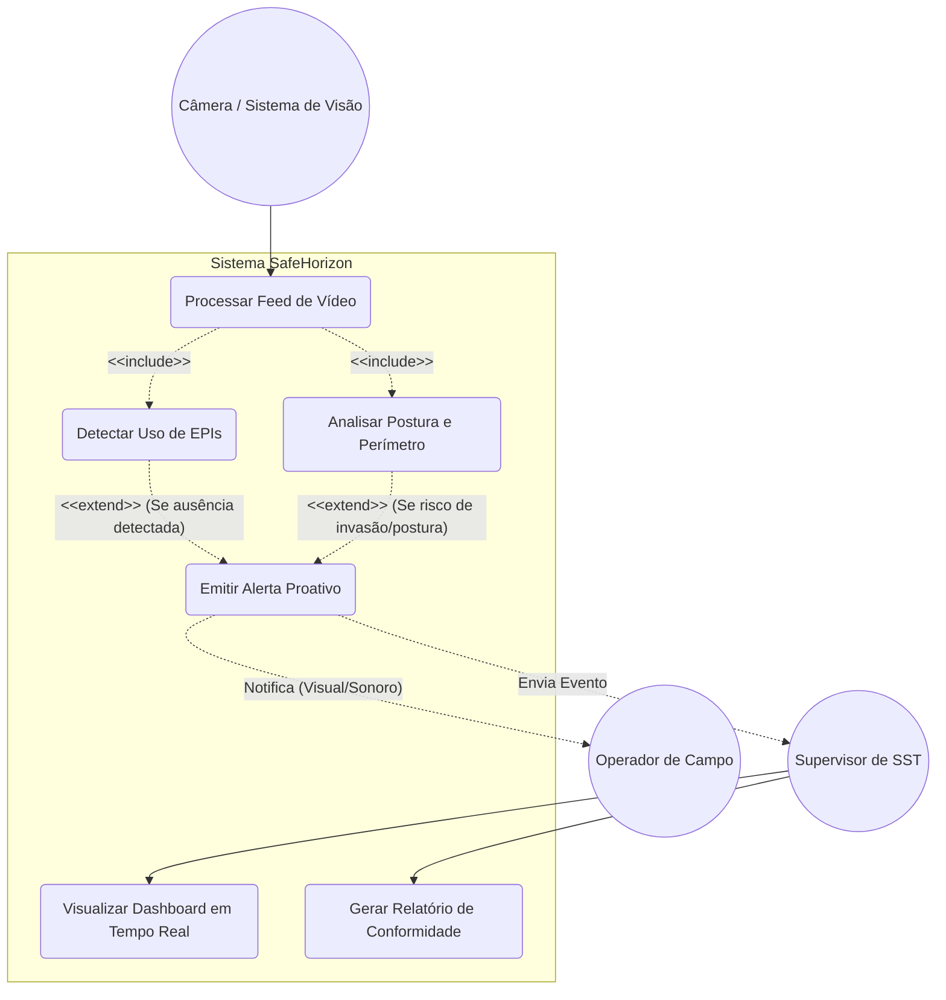
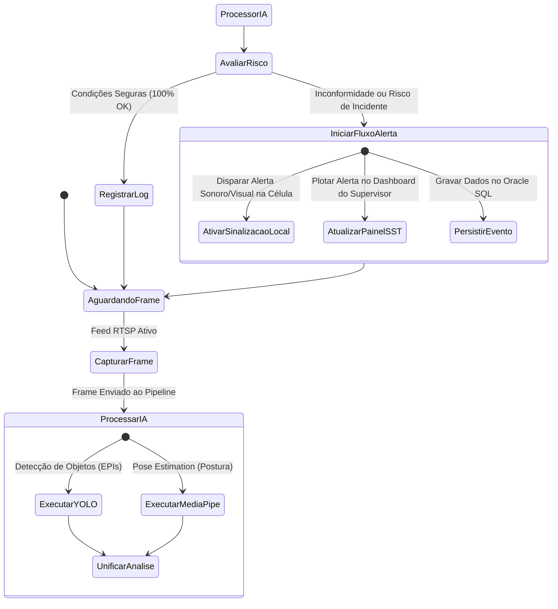
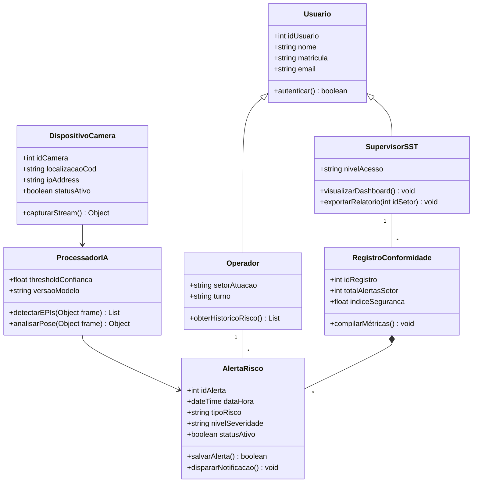

### A. Diagrama de Casos de Uso

```mermaid
graph TD
    %% Definição dos Atores
    Operador((Operador de Campo))
    Supervisor((Supervisor de SST))
    SistemaCamera((Câmera / Sistema de Visão))

    %% Limite do Sistema SafeHorizon
    subgraph Sistema SafeHorizon
        UC1(Processar Feed de Vídeo)
        UC2(Detectar Uso de EPIs)
        UC3(Analisar Postura e Perímetro)
        UC4(Emitir Alerta Proativo)
        UC5(Visualizar Dashboard em Tempo Real)
        UC6(Gerar Relatório de Conformidade)
    end

    %% Relacionamentos do Sistema de Visão
    SistemaCamera --> UC1
    UC1 -.-> |"&lt;&lt;include&gt;&gt;"| UC2
    UC1 -.-> |"&lt;&lt;include&gt;&gt;"| UC3

    %% Extensões para o Alerta Proativo
    UC2 -.-> |"&lt;&lt;extend&gt;&gt; (Se ausência detectada)"| UC4
    UC3 -.-> |"&lt;&lt;extend&gt;&gt; (Se risco de invasão/postura)"| UC4

    %% Interações com os Atores Humanos
    UC4 -.-> |"Notifica (Visual/Sonoro)"| Operador
    UC4 -.-> |"Envia Evento"| Supervisor

    %% Relacionamentos do Supervisor
    Supervisor --> UC5
    Supervisor --> UC6
```
### B. Diagrama de Atividades

```mermaid
stateDiagram-v2
    [*] --> AguardandoFrame
    AguardandoFrame --> CapturarFrame : Feed RTSP Ativo
    CapturarFrame --> ProcessarIA : Frame Enviado ao Pipeline

    state ProcessarIA {
        [*] --> ExecutarYOLO : Detecção de Objetos (EPIs)
        [*] --> ExecutarMediaPipe : Pose Estimation (Postura)
        ExecutarYOLO --> UnificarAnalise
        ExecutarMediaPipe --> UnificarAnalise
    }

    ProcessorIA --> AvaliarRisco

    state AvaliarRisco <<choice>>
    AvaliarRisco --> RegistrarLog : Condições Seguras (100% OK)
    AvaliarRisco --> IniciarFluxoAlerta : Inconformidade ou Risco de Incidente

    state IniciarFluxoAlerta {
        [*] --> AtivarSinalizacaoLocal : Disparar Alerta Sonoro/Visual na Célula
        [*] --> AtualizarPainelSST : Plotar Alerta no Dashboard do Supervisor
        [*] --> PersistirEvento : Gravar Dados no Oracle SQL
    }

    RegistrarLog --> AguardandoFrame
    IniciarFluxoAlerta --> AguardandoFrame
```
### C. Diagrama de Classes

```mermaid
classDiagram
    class Usuario {
        +int idUsuario
        +string nome
        +string matricula
        +string email
        +autenticar() boolean
    }

    class Operador {
        +string setorAtuacao
        +string turno
        +obterHistoricoRisco() List
    }

    class SupervisorSST {
        +string nivelAcesso
        +visualizarDashboard() void
        +exportarRelatorio(int idSetor) void
    }

    class DispositivoCamera {
        +int idCamera
        +string localizacaoCod
        +string ipAddress
        +boolean statusAtivo
        +capturarStream() Object
    }

    class ProcessadorIA {
        +float thresholdConfianca
        +string versaoModelo
        +detectarEPIs(Object frame) List
        +analisarPose(Object frame) Object
    }

    class AlertaRisco {
        +int idAlerta
        +dateTime dataHora
        +string tipoRisco
        +string nivelSeveridade
        +boolean statusAtivo
        +salvarAlerta() boolean
        +dispararNotificacao() void
    }

    class RegistroConformidade {
        +int idRegistro
        +int totalAlertasSetor
        +float indiceSeguranca
        +compilarMétricas() void
    }

    Usuario <|-- Operador
    Usuario <|-- SupervisorSST
    DispositivoCamera --> ProcessadorIA
    ProcessadorIA --> AlertaRisco
    Operador "1" -- "*" AlertaRisco
    SupervisorSST "1" -- "*" RegistroConformidade
    RegistroConformidade *-- "*" AlertaRisco
```
