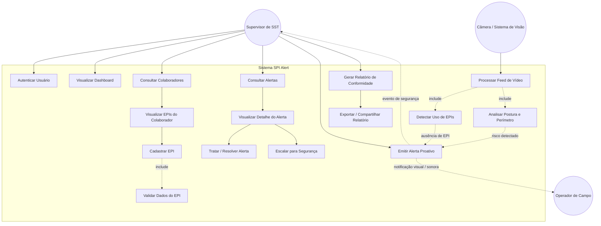
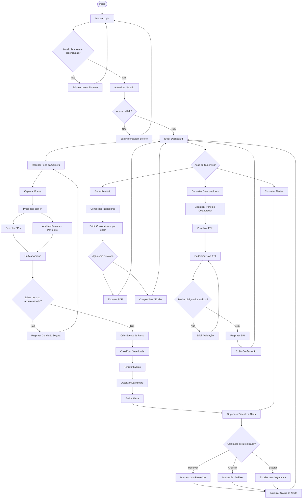
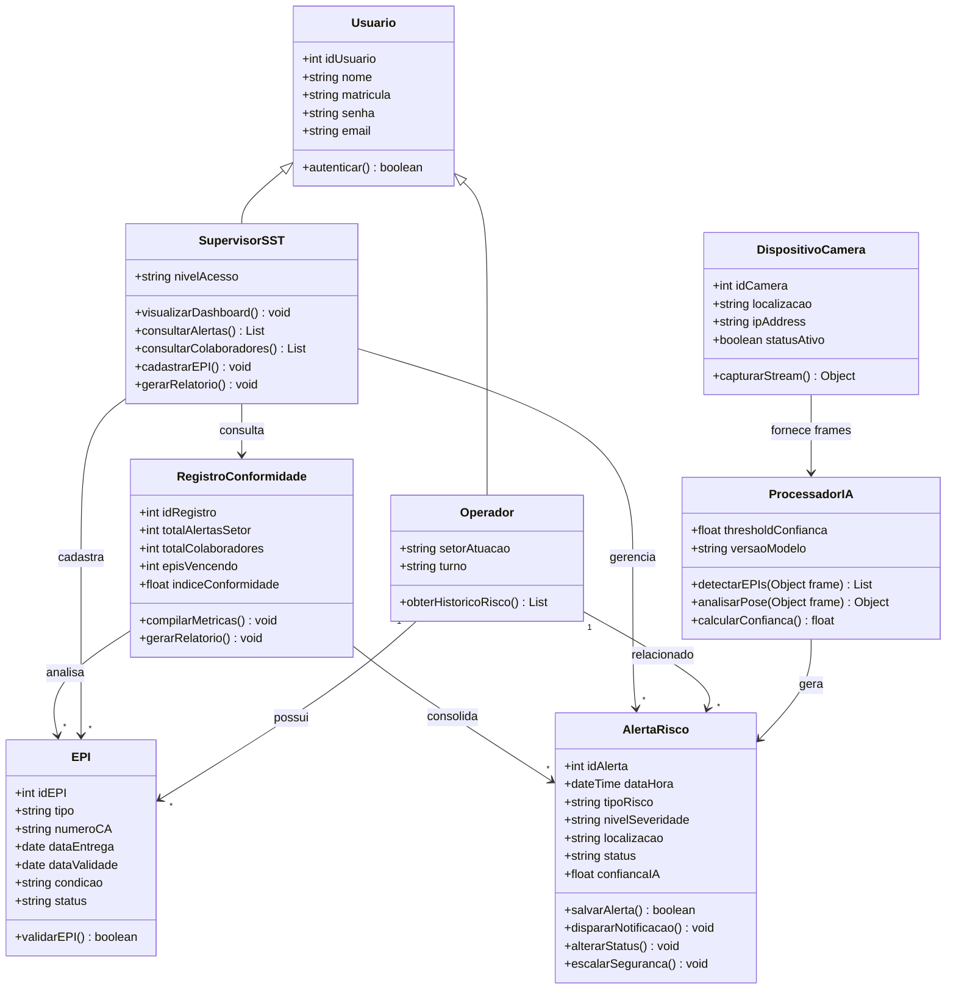
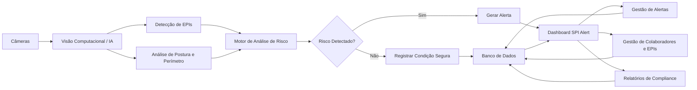

# Diagramas UML — SPI Alert (FutureVision)

Este documento apresenta os diagramas atualizados do **SPI Alert**, considerando as funcionalidades implementadas no protótipo atual: autenticação, dashboard, visão computacional, detecção de EPIs, gestão de colaboradores, cadastro de EPIs, gestão de alertas e relatórios de conformidade.

---

## A. Diagrama de Casos de Uso

---

## B. Diagrama de Atividades

---

## C. Diagrama de Classes

---

## D. Diagrama de Arquitetura Funcional

---

## Fluxo Geral do Sistema

O funcionamento do SPI Alert pode ser resumido em dois fluxos principais.

### Fluxo Automatizado

**Câmera → Visão Computacional → Detecção de EPI/Postura → Análise de Risco → Alerta → Dashboard → Supervisor → Tratamento**

### Fluxo Operacional

**Login → Dashboard → Colaboradores/EPIs → Alertas → Relatórios → Compliance**